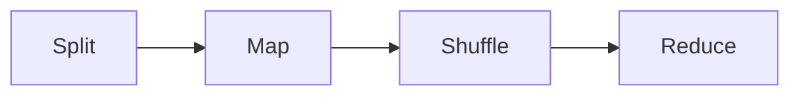

我们需要对hadoop有一定的基础了解，Hadoop可以分为以下几个部分：
- HFDS，也就是Hadoop的文件系统
- MapReduce，Hadoop的编程模型

MapReduce 是一个批处理系统，每次运行会处理整个数据集或至少一个数据集的大部分。运行时间稍长。Hadoop可以运行各种语言的MapReduce程序，而且他们本质上是并行运行的，因此适合用于处理比较大的数据集
## MapReduce
MapReduce 分为两个部分，map和reduce。每个阶段以键值对作为输入和输出，而我们要做的是给他们写map函数和reduce函数。
在我们上课的教案中，还有一个阶段是split，也就是将数据分割开来。其中的key值为每个数据对于第一行的偏移量，也就是从零开始计算的行号。这个行号并不重要，我们只是为了满足MapReduce对输入的要求（键值对）才这么处理。
这样的一步预处理之后，数据就开始被我们写的map函数处理，其输出结果会被传入reduce函数。举例来说，对于一个寻找一年中最高温的程序，我们的map函数的输出就是对应的键值对的年份作为key，温度作为value；如果我们的目的是计算词频，map函数处理的结果就是对每一个出现的词语都创建一个键值对，词语作为key，value为1（在后续的reduce里面进一步处理）
大致流程图：

